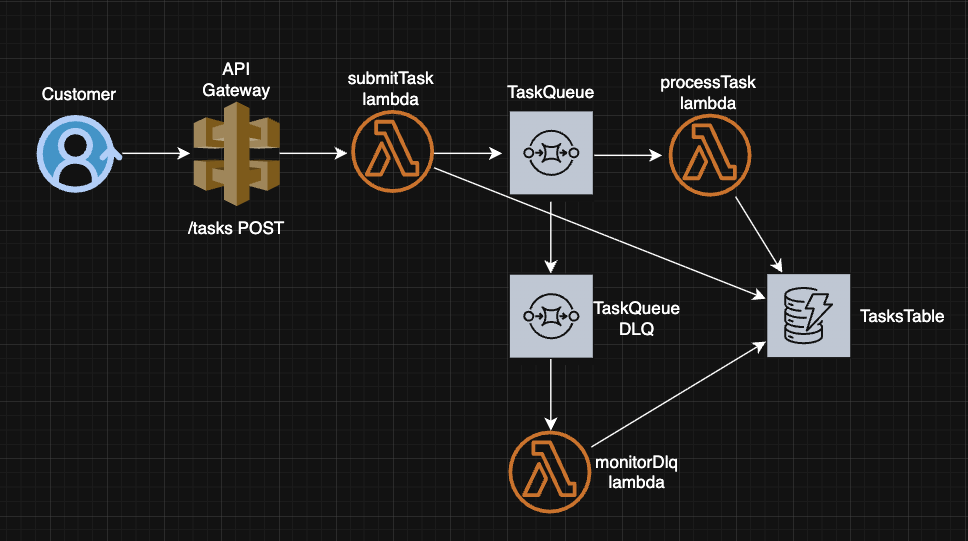

# AWS Task Processing Demo

This is a simple application that imitates task processing using **AWS services**: `API Gateway`, `Lambda`, `SQS`, `DynamoDB`, and `CloudWatch`.

---

## Architecture

Here is a simple diagram showing the flow:



---

## 🔄 Workflow

1. **submitTask Lambda**  
   - Invoked by API call  
   - Stores the initial item in DynamoDB  
   - Sends a message to `TaskQueue` (SQS)  

2. **processTask Lambda**  
   - Triggered by SQS
   - Marks task as `PROCESSING`  
   - Simulates 1s processing time  
   - With 30% probability fails → retry with exponential backoff  
   - After 3 failures → moves to DLQ  

3. **monitorDlq Lambda**  
   - Listens for messages in DLQ  
   - Fetches task details from DynamoDB  
   - Logs information, then deletes the message from DLQ  

---

## ⚙️ Task Processing Logic

- **processTask Lambda**  
  - Fails task jobs **30% of the time** (controlled by `FAILURE_RATE` env var).  
  - Implements **exponential backoff** by increasing message visibility timeout on retries.  
  - Tasks succeed or fail after up to 3 attempts. On 3rd failed attempt task will land into DLQ

**Task statuses in DB:**
- ✅ `COMPLETED` – successfully processed tasks  
- ❌ `FAILED_FINAL` – tasks that failed after 3 attempts (moved to DLQ) 
- ❌ `FAILED_PENDING` – tasks that failed but no 3 attempts yet
- 🔄 `PROCESSING` – task is currently running 
- ℹ️ Each task also contains the **number of processing attempts**

---

## 🚀 Deployment

1. Clone the repository  
   ```bash
   git clone https://github.com/Dvate/task-processing.git
   cd task-processing
   ```
2. Install dependencies  
   ```bash
   npm install
   ```
3. Authenticate with your AWS account  
   ```bash
   aws configure
   ```
4. Deploy to AWS  
   ```bash
   npm run deploy
   ```

✅ After deployment, you will receive an **API URL** that you can use for testing.

---

## 🧪 Testing

A helper script `test.js` is available in the project root.  
It accepts **3 arguments**:

```
node test.js <API_URL> [count] [concurrency]
```

- **API_URL** – required, the URL of your deployed API  
- **count** – optional, number of requests (default: `100`)  
- **concurrency** – optional, number of parallel requests (default: `1`)  

⚠️ Avoid setting concurrency too high, or API Gateway may return `503` errors.

**Example:**
```bash
node test.js https://5o1oxwgj3l.execute-api.eu-west-1.amazonaws.com/tasks 500 20
```

---

## 📝 Author Notes

- I was not sure if it is required to keep the message in dlq, as after monitorDlq lambda receives message, it deletes it from there. I considered it is not needed, and just logging the message is enough
- I used aws-sdk v2 even though I know it is deprecated. `npm install aws-sdk` installs v2 by default, and I was like "OK, let it be"
- I ommited on purpose some improvements like input validation, better error handling and logging, and so on. I think main focus of this task is to check AWS serverless knowledge of the candidate, so I focused on that part
